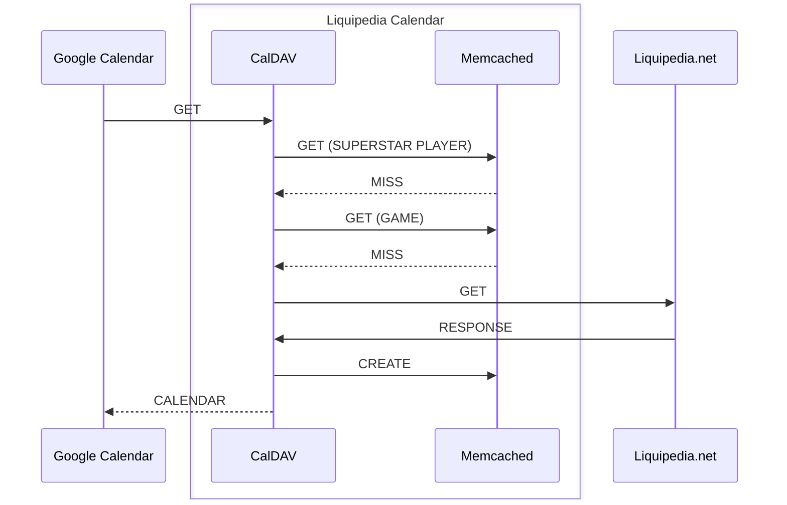
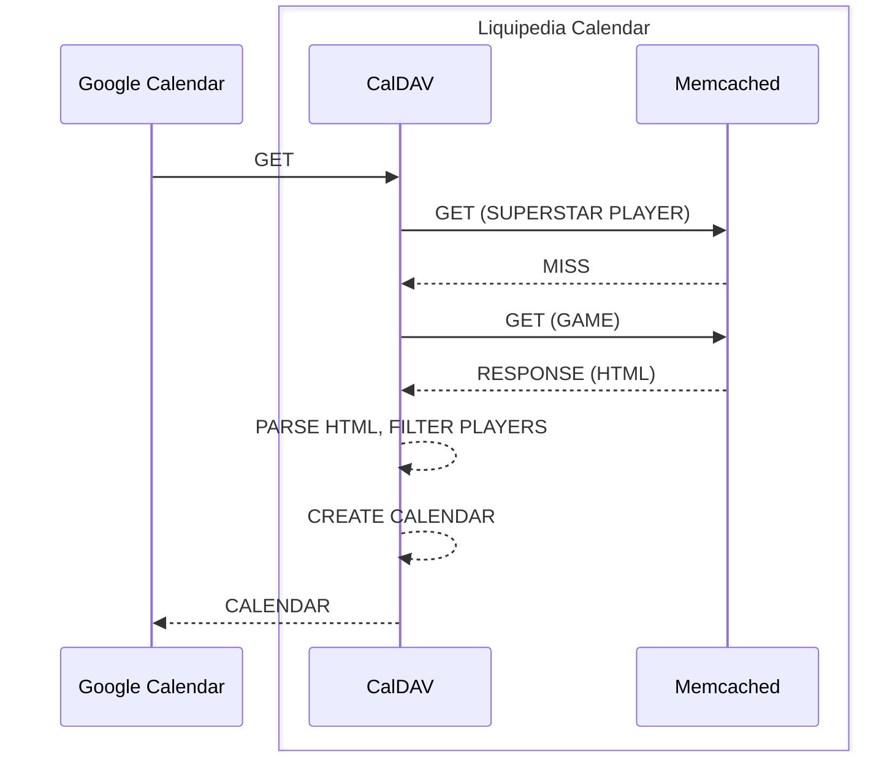
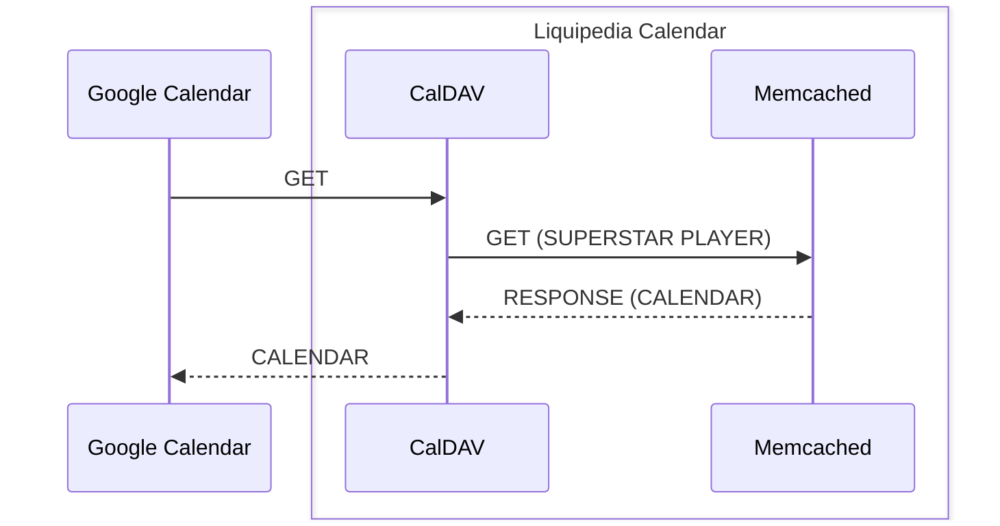

# System Design

### Cache miss

When a user (Google Calendar) requests the Liquipedia Calendar, the application will first check if the data is in the cache (Memcached). If it is not, the application will fetch the data from Liquipedia.net and store it in the cache.
This will take some time as it depends synchronously on the response time of Liquipedia.net. Additionally, it exposes Liquipedia.net to the risk of being overwhelmed by requests from my own application.

### Cache hit (game)

Once a first request has been made, the data will be stored in the cache. Subsequent requests will be served from the cache, which is much faster than fetching the data from Liquipedia.net.
The data will expire after a set period of time, for now 3 hours. As a request is tied to a game (but not a player!), the cache key is the game name.
The cache not only speeds up the application, but also protects Liquipedia.net from being overwhelmed by requests.

### Cache hit (superstar player)

Once a first request has been made, the data will be stored in the cache. Subsequent requests will be served from the cache, which is much faster than fetching the data from Liquipedia.net.
The data will expire after a set period of time, for now 3 hours. As a request is tied to a game (but not a player!), the cache key is the game name.
The cache not only speeds up the application, but also protects Liquipedia.net from being overwhelmed by requests.

### Google Cloud

The application is hosted on Google Cloud Platform (GCP). The application is a Go application running on Google App Engine (GAE), which also provides the Memcached service.
The application is served over HTTPS using Google Cloud Load Balancer (GCLB). The application is monitored using Google Cloud Monitoring (GCM) and Google Cloud Logging (GCL).
