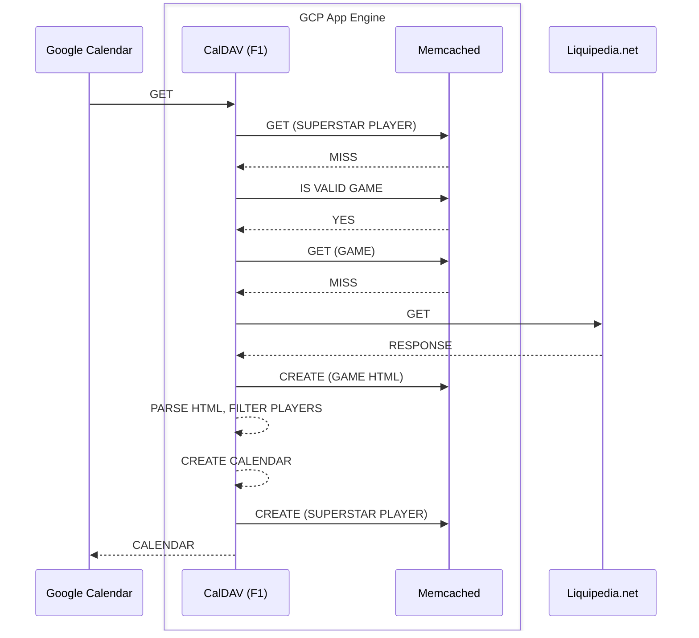
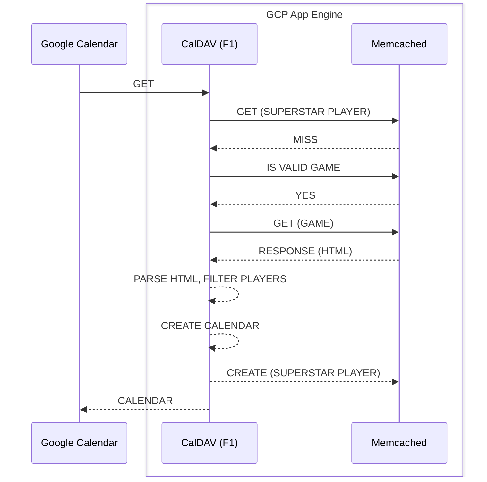
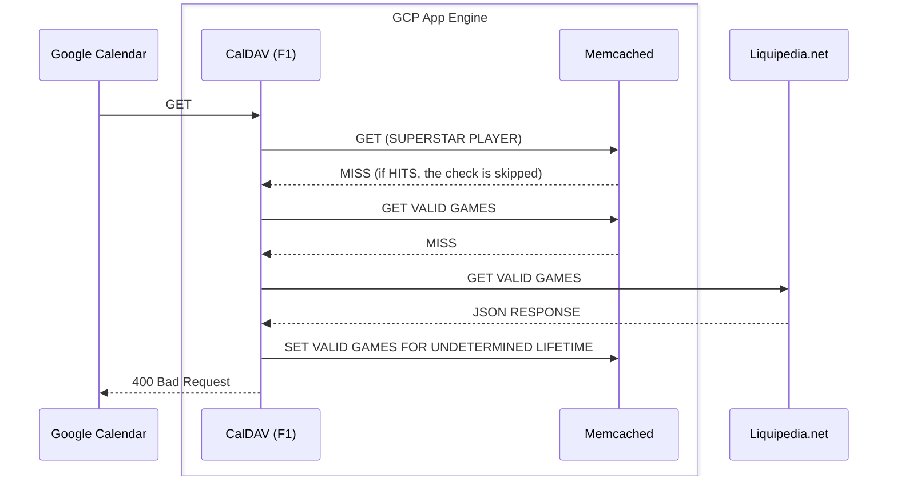
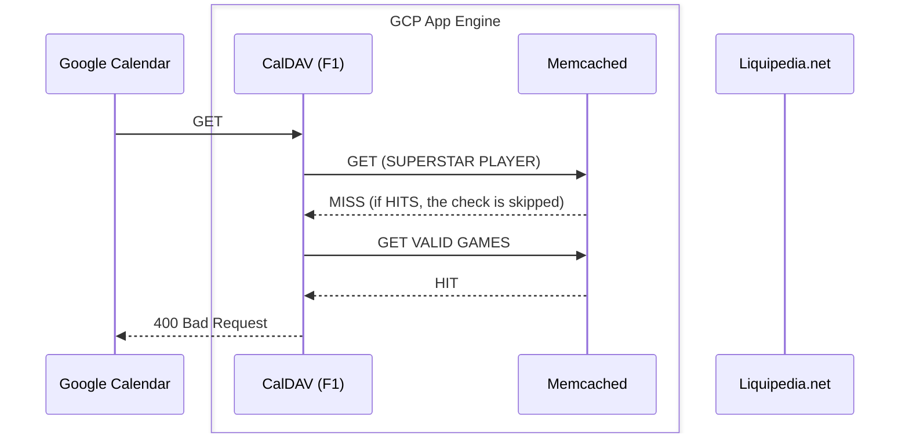

# System Design

### Google Cloud

The application is hosted on Google Cloud Platform (GCP). The application is a Go application running on Google App Engine (GAE), which also provides the Memcached service.
The application is served over HTTPS using Google Cloud Load Balancer (GCLB). The application is monitored using Google Cloud Monitoring (GCM) and Google Cloud Logging (GCL).

### Cache miss

When a user (Google Calendar) requests the Liquipedia Calendar, the application will first check if the data is in the cache (Memcached). If it is not, the application will fetch the data from Liquipedia.net and store it in the cache.
This will take some time as it depends synchronously on the response time of Liquipedia.net. Additionally, it exposes Liquipedia.net to the risk of being overwhelmed by requests from my own application.

Note that `IS VALID GAME` will be a check on validity of the request. Assuming it is a well intentioned user, it will always be yes, and very oftenly a cache hit.

### Cache hit (game)

Once a first request has been made, the data will be stored in the cache. Subsequent requests will be served from the cache, which is much faster than fetching the data from Liquipedia.net.
The data will expire after a set period of time, for now 3 hours. There will be 2 cache keys types: one for the superstar player and one for the game.
If the player requested isn't found in the cache, but the game is, the application will receive HTML data from the cache.
The application will then filter players from the retrieved HTML data from the cache, and create the calendar.
The cache not only speeds up the application by removing external network calls, but also protects Liquipedia.net from being overwhelmed by requests.

### Cache hit (superstar player)

If the player requested is found in the cache, the application will receive the calendar data from the cache. This is the fastest way to serve the data, as it doesn't require any external network calls,
and the data is already in the format required by Google Calendar. There is no HTML parsing, filtering or calendar creation required.

### Protecting against non valid use

If a mal intentioned user use a non valid game entry, it should in theory not proceed to an HTTP request to liquipedia.net, and deny instantly.
To do so, here's the `IS VALID GAME` check detailed :

**Valid games entry empty, invalid game**

**Valid games entry filled, invalid game**

