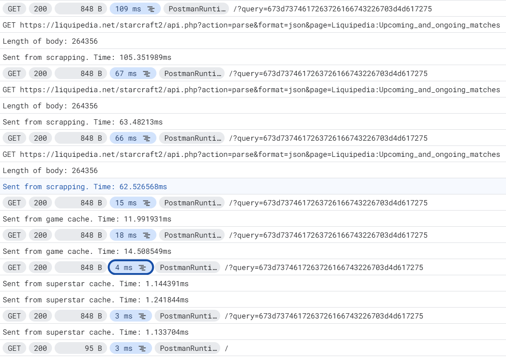

# Benchmarks on GCP App Engine F1 instance (2024)

There are multiple cases :
1. instance state due to pod autoscaling
- cold start : 0 instance running, so need to start an instance
- warm start : 1+ instance running, so no need to start an instance
2. cache state
- no cache : cache is empty, so need to fetch data from Liquipedia.net
- cache (game) hit : cache contains the game, so no need to fetch data from Liquipedia.net
- cache (superstar player) hit : cache contains the superstar player, so the calendar is sent from Memcached directly.

Instance/Cache | No cache                                                 | Cache (game) hit                     | Cache (superstar player) hit
--- |----------------------------------------------------------|--------------------------------------| ---
Cold start | 940 ms                                                   | TBD                                  | TBD
Warm start | 250-300 ms total 60-120 ms req 2 resp | 191 ms total 15-20 ms req 2 resp | 182 ms total 3 ms req 2 resp

Also, for the bad requests cases, the application responds with a 404 status code in 3 ms req 2 resp.
It means that the CalDAV has virtually no latency if the superstar player cache is hit.
If the game cache is hit, the latency is around 6 times higher than the "hello world" (404) case.
On full miss, the latency is at least 20 times higher than the "hello world" case, with high volatility due to external API calls.

